# Project 3: Design Journey

**For each milestone, complete only the sections that are labeled with that milestone.** Refine all sections before the final submission.

You are graded on your design process. If you later need to update your plan, **please do not delete the original plan, leave it in place and append your new plan _below_ the original.** Then explain why you are changing your plan. Any time you update your plan, you're documenting your design process!

**Replace ALL _TODOs_ with your work.** (There should be no TODOs in the final submission.)

Be clear and concise in your writing. Bullets points are encouraged.

**Everything, including images, must be visible in _Markdown: Open Preview_.** If it's not visible in the Markdown preview, then we can't grade it. We also can't give you partial credit either. **Please make sure your design journey should is easy to read for the grader;** in Markdown preview the question _and_ answer should have a blank line between them.


## Existing Project (Milestone 1)

**Tell us about the project you'll be using for Project 3.**

### Project (Milestone 1)
> Which project will you add interactivity to enhance the site's functionality?

Project 1


### Audience (Milestone 1)
> Briefly explain your site's audience.
> Be specific and justify why this audience is a **cohesive** group.

Researchers, academics and students who are interested in the fields of urban studies, data science and sustainability.

This includes future researchers looking for collaboration, future HRs assessing my experiences, and students who have similar interests and want to learn more about my experience.


### Audience's Goals (Milestone 1)
> List the audience's goals that you identified in Project 1 or 2.
> Simply list each goal. No need to include the "Design Ideas and Choices", etc.
> You may adjust the goals if necessary.

1. Learn about my past and ongoing projects to evaluate whether or not to collaborate or connect

2. Find ways to contact me or follow me for collaboration, invitation or networking

3. Retrieve my resume and learn about my past academic or career experiences to evaluate whether or not to invite me to events, hire me as an intern

4. Learn about my past experiences and projects to gather research ideas


## Interactivity Design (Milestone 1)

### Interactivity Brainstorm (Milestone 1)
> Using the audience goals you identified, brainstorm possible options for interactivity to enhance the functionality of the site while also assisting the audience with their goals.
> Briefly explain each idea and provide a brief rationale for how the interactivity enhances the site's functionality for the audience.
> Note: You may find it easier to sketch for brainstorming. That's fine too. Do whatever you need to do to explore your ideas.

- A dropdown menu for  "Projects" and "Experiences" on the main/top navigation bar.
  - I thought this would enhances experiences to provide more speedy and efficient navigation to the needed content for my audience, who are likely to value their time greatly with tense academic works. Users could get to their desired content with just one click from the Home page, without the need of even scrolling.
- Use a carousel for the card-like content in "Skills" section in "Experiences" page, or for the content in "Who am I?" "Skills" section in Home page.
  - I thought this would utilise the space more efficiently. Currently, the information occupies two rows with different widths. Organizing them in a single row, but with carousel, would enhance the functionality for my audience as it provides more visual uniformity and therefore allows quicker identification of key information and navigation. This is true as not all of my audience are interested in the same skill that I have
- Use a accordian to organize information under the "Work Experience" section in the "Experiences" page.
  - I thought using accordian would make more efficient use of space. It allows my audience, which might be in interest in slightly different experieces, to quickly get to their desired information withou needing to read/scroll past the other irrelevant info. They will just open the one they are interested in once they read the title.
- Modal to display larger images for each of the figures and graphs inside the projects pages
  - This is to allow my audience, who are in academic fields, to look up closely at the images that contains information integral to the project/article. These academic audience would likely want to know about the details of graphs, maps, charts, etc. A modal would facilitate this without the images occupying too much space on the page.


### Interactivity Design Ideation (Milestone 1)
> Explore the possible design solutions for the interactivity.
> Sketch several iterations of your interactivity.
> Annotate each sketch explaining what happens when a user takes an action. (e.g. When user clicks this, something else appears.)

#### Sketches for dropdown menu
Iteration 1:
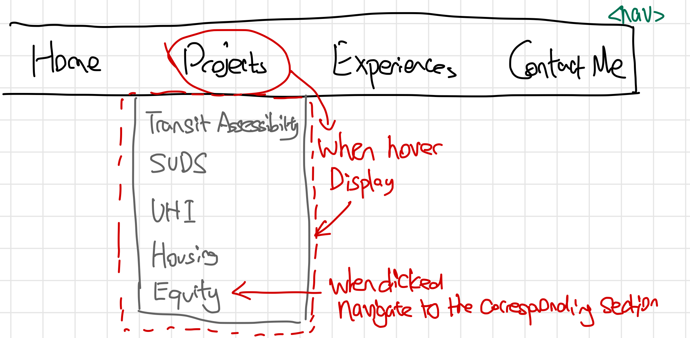

Iteration 2:
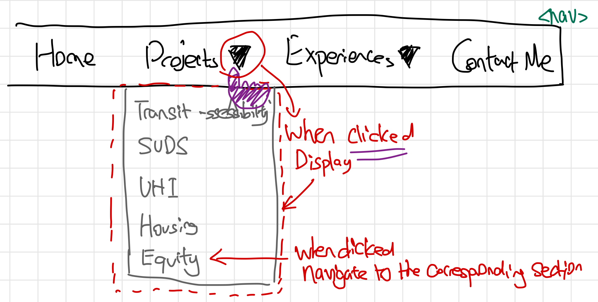

Iteration 3:
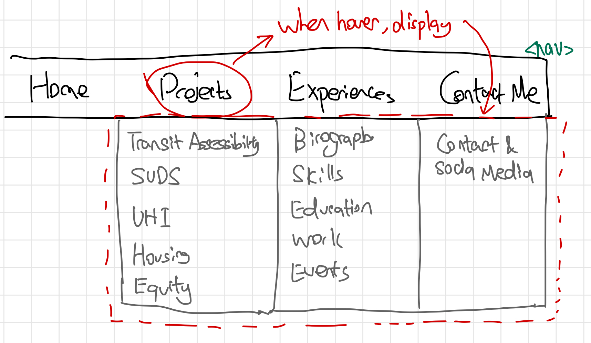

#### Sketches for carousel
Iteration 1:
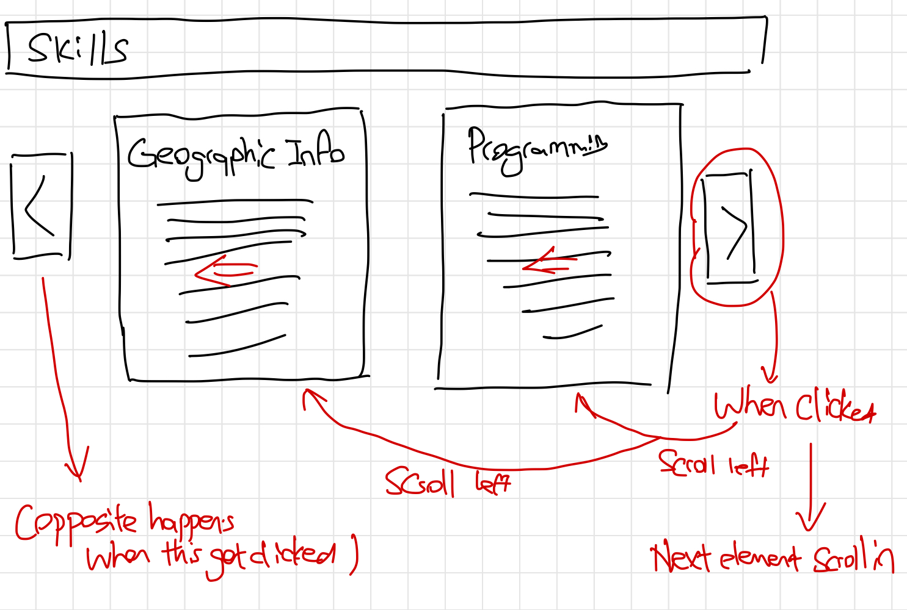

Iteration 2:
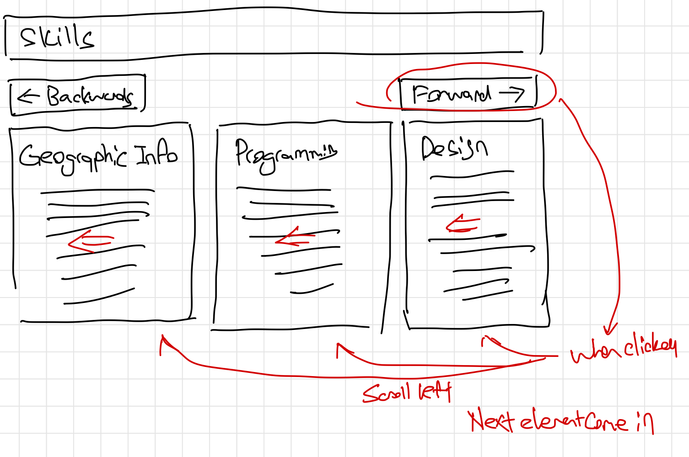

#### Sketches for accordian
Iteration 1:
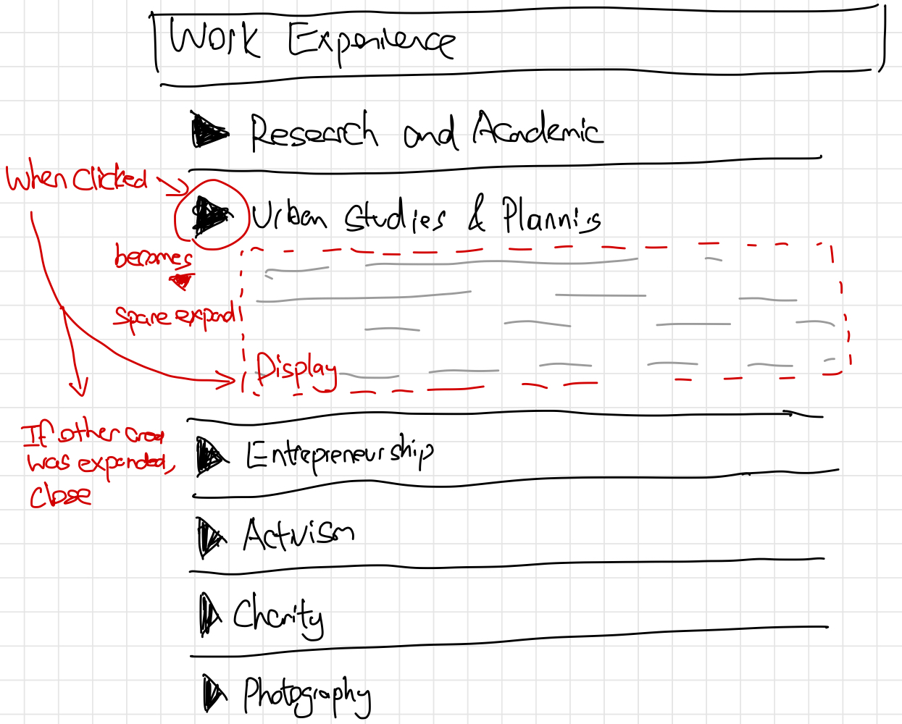

Iteration 2:
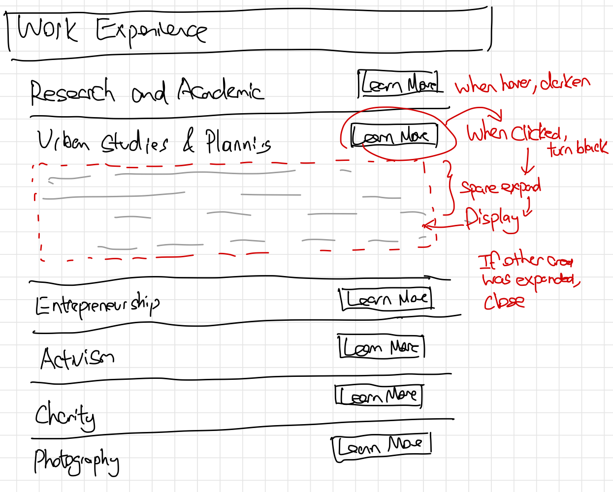

#### Sketches for modals
Iteration 1:
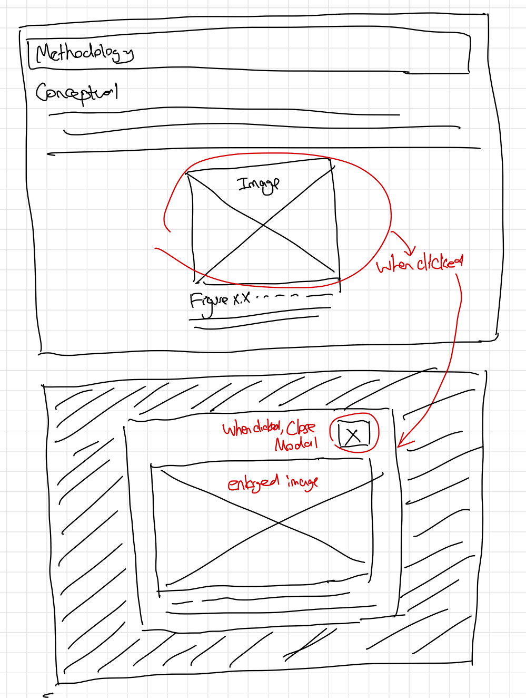

Iteration 2:
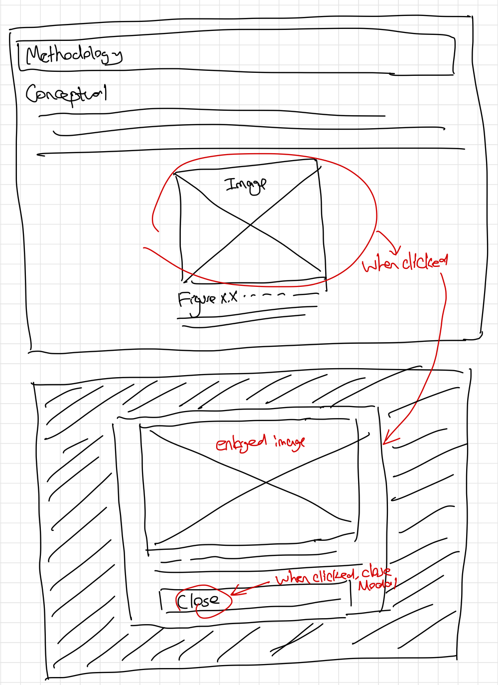


### Final Interactivity Design (Milestone 1)
> Create _polished_ sketch(es) (it's still a sketch, but with a little more care taken to communicate ideas clearly to the graders) to plan your interactivity.
> **Sketch out the entire page where your interactivity will go.**
> Include your interactivity to the sketch(es).
> Add annotations to explain what happens when the user takes an action.
> Include as many sketches as necessary to communicate your design (ask yourself, could another 1300 take these sketches an implement my design?)

I have decided to adopt the iteration 1 of dropdown menu. This is because it is the most commonly seen design pattern and is the most intuitive. The final sketch:


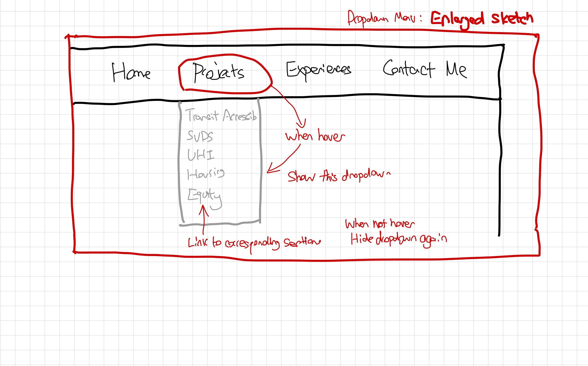

I have decided to not use the carousel. This is because I have re-evaluated and thought that the amount of card-like content is not to the level that need a carousel.

I have decided to use iteration 1 of the accordian. The final sketch:


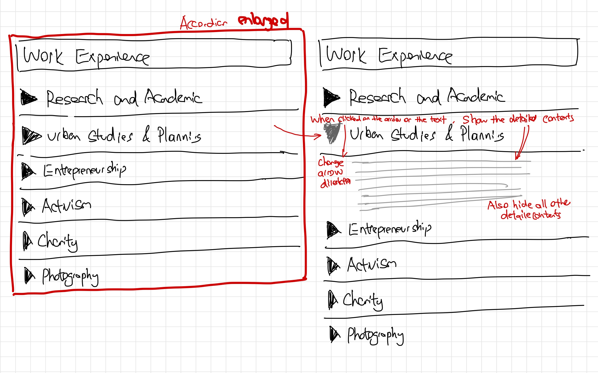

I have decided to use iteration 1 of the modal, but made some slight changes in terms of adding a "enlarge" button below the thumnail. In this way, I thought it gives more clue to the user on what action they can perform. The final sketch:

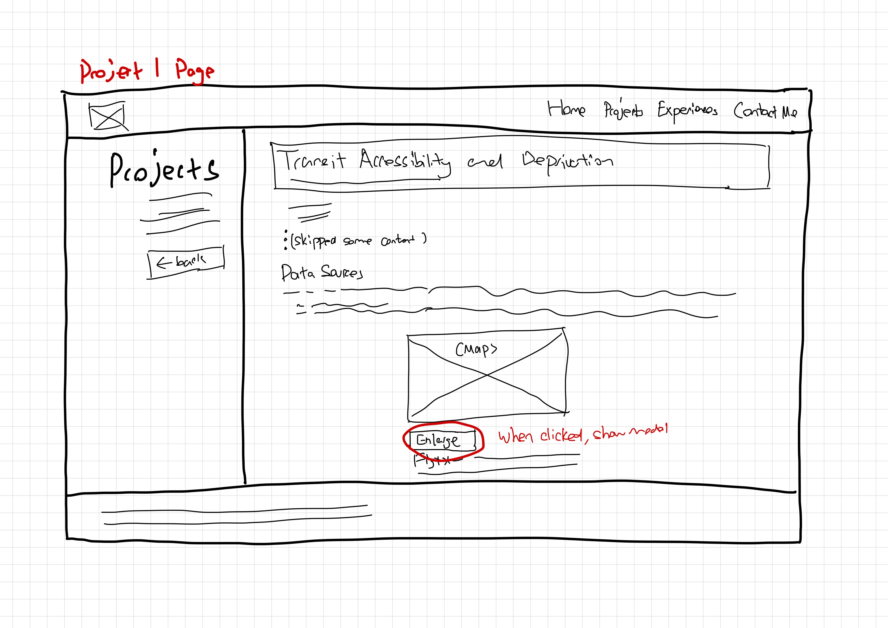

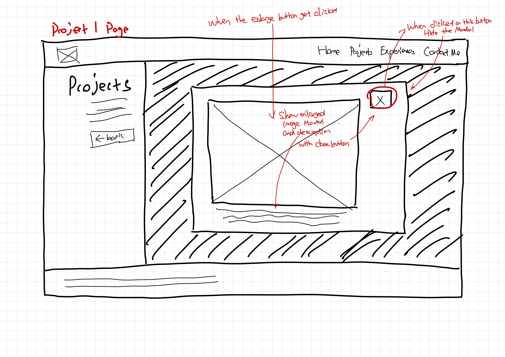

### Interactivity Rationale (Milestone 1)
> Describe the purpose of your proposed interactivity.
> Provide a brief rationale explaining how your proposed interactivity addresses the goals of your site's audience.
> This should be about a paragraph. (3-5 sentences)

The interactive features would help facilitate the audience to achive their goals by being functional. The designed dropdown menu allows more efficient, one step navigation for users to get to their desired content. It facilitates goal 1 and 4 of my audiences. The accoridna provides clearer intra-page filtering - allowing audience to achieve goal 4 quicker - as they can expand the content that they want only without the need to read the details of the rest. The modal allows audiences that want to learn more about my projects (goal 1) to expand and view the images/graphs/maps they want to see, without the content being too large and occupies unnessesary space on the main page.

The features also satisfies the "Affordances" quality. They give clues on what action they provide. The accordian have a hroizontal triangular arrow - a common way of suggesting that it is expandable. Similarly, the modal have a "Enlarge" button, which intuitively make sense that it can expand the image. The "X" on the button at the top of the modal also clearly suggests that it is for closing the window.

Each action also have visual feedback, with the dropdown showing a expanded menu under the existing top navigation, the modal showing a overlayed box with an image and its description. The accordance will expand and display the details once a user clicks.

All these design employs familiar design patterns. The accordances with each heading separated by lines and have an arrow that rotates is seen in many websites. Similar modal and dropdown designs are also widely employed in many modern websites.


## Interactivity Implementation Plan (Milestone 1)

### Interactivity Planning Sketches (Milestone 1)
> Produce planning sketches that include all the details another 1300 student would need to implement your interactivity design.

TODO: planning sketches


### Interactivity Pseudocode Plan (Milestone 1)
> Write your interactivity pseudocode plan here.
> Pseudocode is not JavaScript. Please do not put JavaScript code here.

```
TODO: pseudocode
```


### "Ambitious" Interactivity Explanation (Milestone 1)
> In your own words, concisely explain why you believe your interactivity meets the "ambitious" requirement.
> This should be a few sentences. (1-3 sentences)

TODO: ambitious justification


## Grading (Final Submission)

### Interactivity Usability Justification (Final Submission)
> Explain how your design effectively uses affordances, visibility, feedback, and familiarity.
> Write a large paragraph (4-6 sentences)

TODO: interactivity rationale


### Tell Us What to Grade (Final Submission)
> We aren't re-grading your Project 1 or 2.
> We are only grading the interactivity you added.
> Tell us where (what pages) we can find your interactivity and how to use it.
> **We will only grade what you list here;** if it's not listed, we won't grade it.

TODO: what should we grade


### Collaborators (Final Submission)
> List any persons you collaborated with on this project.

TODO: list your collaborators


### Reference Resources (Final Submission)
> Please cite any external resources you referenced in the creation of your project.
> (i.e. W3Schools, StackOverflow, Mozilla, etc.)

TODO: list reference resources


### Self-Reflection (Final Submission)
> This was the first project in this class where you coded some JavaScript. What did you learn from this experience?

TODO: self-reflection


> Take some time here to reflect on how much you've learned since you started this class. It's often easy to ignore our own progress. Take a moment and think about your accomplishments in this class. Hopefully you'll recognize that you've accomplished a lot and that you should be very proud of those accomplishments!

TODO: self-reflection
